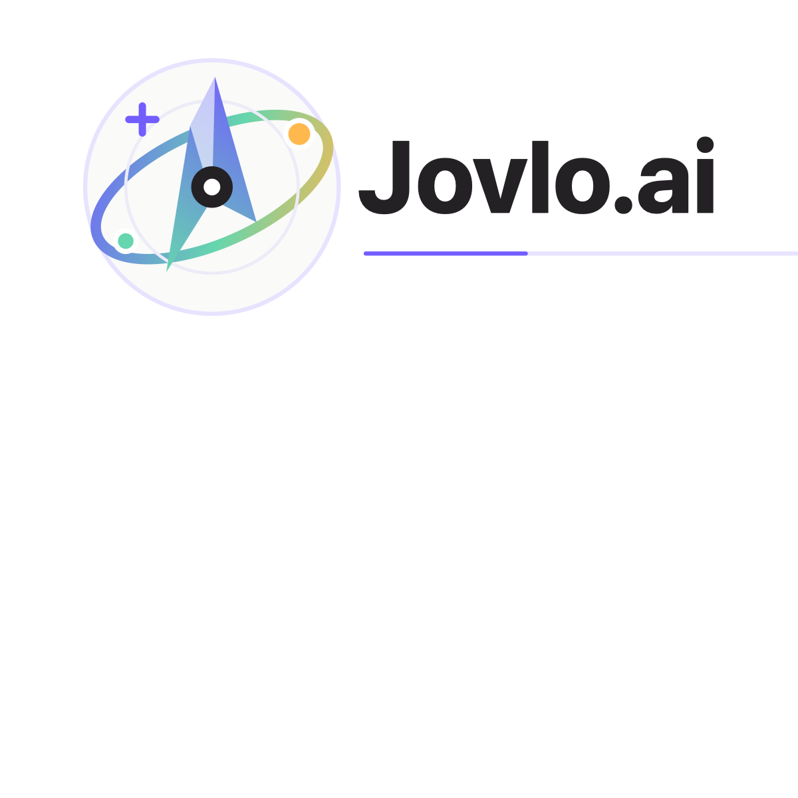

# Jovlo.ai



Jovlo.ai 是一个面向真实旅行决策的 AI 路书共创项目。本仓库当前展示海南自驾 Web MVP 的交互与技术蓝图。

## 当前原型

打开 [`hainan-roadtrip-blueprint.html`](hainan-roadtrip-blueprint.html) 可以查看五个交互视图：

- 体验闭环：从模糊想法到可执行路书
- 出发前：海南 Day 1-5 地图、时间轴、住宿与预算联动
- 出发中：迟到、疲劳、下雨时的局部重排
- 路线引擎：POI 校验、驾车矩阵、时间窗、酒店锚点与预算验算
- 技术落地：Web MVP 架构、范围与实施顺序

页面为单文件 HTML，不需要安装依赖或执行构建：

```bash
open hainan-roadtrip-blueprint.html
```

## MVP 原则

- LLM 负责理解需求和解释变化
- 地图与确定性算法负责路线可行性
- 第一版聚焦海南东线样板和规划态、出行态两种体验
- 先验证可生成、可编辑、可导航的路书，再扩展交易和平台能力

## 仓库结构

```text
.
├── hainan-roadtrip-blueprint.html
└── brand
    ├── current
    ├── logo-concepts
    └── logo-concepts-minimal
```

## 状态

Visual blueprint / MVP definition in progress.
